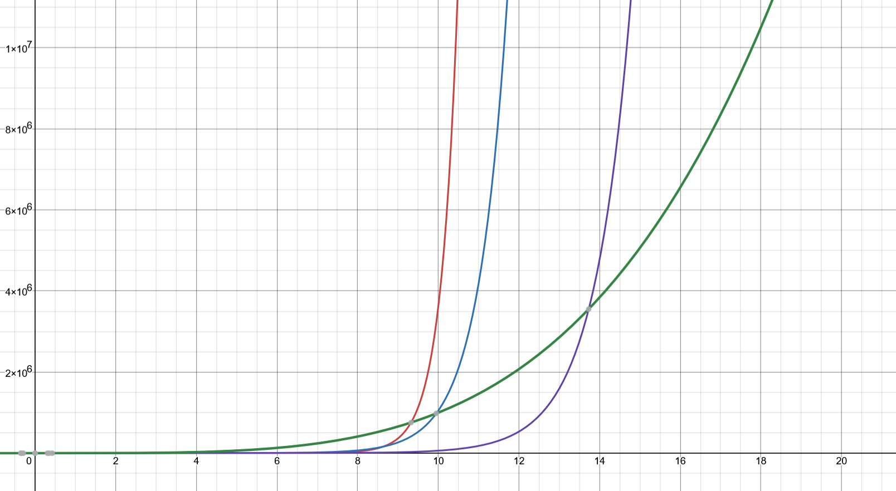
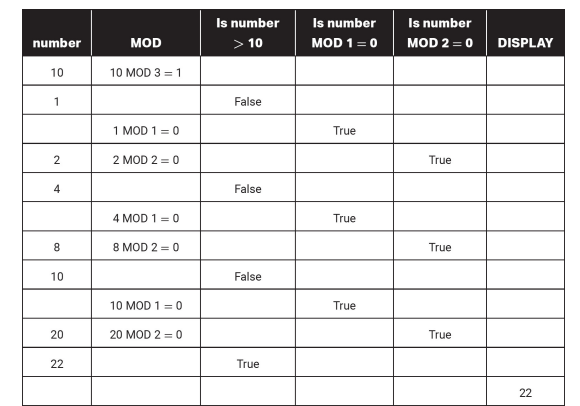
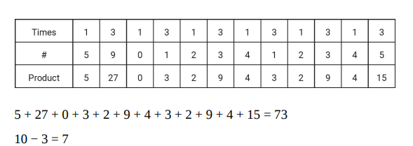

# AP Computer Science Principle Pratice 2 Answers And Explain

## MCQ

1. D. RANDOM return [n, m] so it's has n - m + 1 numbers, [1, 10] has 10 number so check 9 numbers will check 90%
2. B. 2 mod conditions and modified x, z. line 4 is true, so x = 12, line 8 is checking 24 mod 12 == 0 also true, z = 12, so display 12, 12, 12
3. B. A game upgrade from Home System to Mobile, Add GPS. A is Basic, CD is not needed in both
4. C. AB is using GPS. D is input by user.
5. D. Internet is provided by phone it's self game doesn't care.
6. B. The purpose: Exercising + Social + Art
7. B. Using playtime or score or visited you can't make any infomation
8. D. Wrong Math
9. A. Pixel data is file acture data.
10. C. Count how many number is multiples of 10, MOD 10 include the condition MOD 5
11. D.

```js
function display() {}

var num = 0;
if (num > 2) {
  sys.display(num);
  if (num > 7) {
    display(num);
    num = 0;
    display(num);
  } else {
    num += 1;
    gotoLastIf();
  }
} else {
  num = num; // Do nothing
  gotoLastIf();
}

// Result infinite loop
```

12. A. Float point number behave differently
13. C. Binary search need ordered list
14. A. True X1 True return false, reverse condition only True X2 True return True, so X2 is And. X1 is NotAnd.
15. A. Lossless mean more file size.
16. D.

```
rotate_left() [0, 2] times
move_forward() [0, 2] times
```

17. B. index 1 and 2 with a temp variable
18. D. APCSP index start with 1
19. A. Find eqution is not grow exponentially
    
20. A. III is changing when running
21. A.

```JS
A or True // True
True or B // True
True nad True // True
// Display true
```

22. C. Require checkSumOrDiffIs13 but diff needs abs. So 5 - 18 = -13 not 13
23. D. Boolean
24. A.

```js
var petList = ["Dog"];
petList.append("Waffle"); // ["Dog", "Waffle"]
petList.insert(1, "Moose"); // ["Dog", "Moose", "Waffle"]
petList.append("Noodles"); // ["Dog", "Moose", "Waffle", "Noodles"]
petlist.insert(2, "Novack"); // ["Dog", "Moose", "Novack", "Waffle", "Noodles"]
petlist.insert(2, "Benji"); // ["Dog", "Moose", "Benji", "Novack", "Waffle", "Noodles"]
petlist.remove(0); // ["Moose", "Benji", "Novack", "Waffle", "Noodles"]
console.log(petlist); // ["Moose", "Benji", "Novack", "Waffle", "Noodles"]
```

25. B. lossy compression
26. A. Encryp file
27. B. data lose when + 40 but clamp to 255
28. D.

```js
for(let i = 0, i < 11; i++) {
    if can_move(D.FORWARD) {
        move_forward()
    } else {
        rotate_left()
    }
}
// i action
// 0 roate
// 1 rotate
// 2 rotate
// 3 forward
// 4 forward
// 5 rotate
// ... forward
```

29. B. rotate_right and random[0, 4], 3 and 4 hit wall, 3 / 5 chance, so 60%
30. B. require isMultiDiv3(a, b)

```js
a * b mod 3 == 0
a mod 3 * b mod 3 == 0
a mod 3 == 0 and b mod 3 == 0
```

31. C. function is sumL1CanModByL2
32. B. Analog
33. C. Check not equal
34. B. Find close enough solution
35. D. Find item != 13
36. A.
37. B. Cut C around
38. A.
39. C. Phone number not on email
40. D.
41. B.
42. D.
43. B.
44. D.
45. D.
46. B.

```js
var a = 4;
display(1 + a); // 5
a = a + 2; // a == 6
display(a); // 6
if (a < 0) {
  // no
} else {
  display(1 - a); // -5
  display(a); // 6
}
```

47. D.
48. Wrongquestion. rotate_right [0, 2] times, before each rotate move_forward [0, 3] times
49. B.
50. C.

```js
132 - 32 = 100
5 * 100 / 10 = 50
```

51. C.
52. B. -(AUB) = -(-(-A-B)) = -A-B
53. 11

```
C1 2 + 2 + 2
C2 5 + 6
```

54. B.
55. C.
56. C. function isFirstEqualLast
57. C. max should -Inifinite
58. 10

```js
a = 34
b = a - 10 // 24
c = a + 64 // 98
d = a + b // 54
e = a mod b // 10
f = c mod d // 44
g = e mod f // 10
```

59. B.
60. C.
61. A.
62. C.

```js
var number = 10;
numer = number % 3; // 1
while (number <= 10) {
  if (number % 1 == 0) {
    number = number + number;
  }
  if (number % 2 == 0) {
    number = number + 2;
  }
}
console.log(number);
```



63. B.
64. B. 3 == b11, 10001 + 11 = 10100
65. B, C
66. D.

```js
var sum = 0;
for (let i = 0; i < digi.length; i++) {
  var n = digi.getNum(i);
  if (i % 2 == 1) {
    sum += n * 3;
  } else {
    sum += n;
  }
}
return 10 - (sum % 10);
```



67. A,C.
68. A,D.
69. A,C.
70. A,D.

## ✅ 示例项目：`generatePoem(theme)`

**主题生成诗句程序**
语言风格接近 Python/Pseudocode，适合用于 AP CSP 提交。

---

### 🔸 代码结构

```python
# List Section: 用于存储诗歌的单词库
poemWords = ["sunset", "horizon", "glow", "twilight"]

# Procedure Section: 接收主题并生成一句诗句
def generatePoem(theme):
    line = ""
    if theme == "sunset":
        words = ["The", "sun", "sets", "in", "a", "golden", "glow"]
    elif theme == "rain":
        words = ["Raindrops", "fall", "softly", "on", "the", "window"]
    else:
        words = ["This", "theme", "is", "not", "recognized"]

    for word in words:
        line = line + word + " "
    return line.strip()

# Input: 用户输入主题
userInput = "sunset"
outputLine = generatePoem(userInput)
print(outputLine)
```

---

## ✅ 对应 WR 各部分答案（模拟填写）

---

### **WR Q1**

**Describe at least one valid input to your program and what your program does with that input.**

> One valid input to my program is the string `"sunset"`.
> When the user provides this input, the `generatePoem` procedure uses a conditional to check the input. Since it matches `"sunset"`, the program selects a list of sunset-related words like `"The sun sets in a golden glow"`. Then, using a loop, the program builds a string by combining those words and displays the poem to the user.

---

### **WR Q2(a)**

**Describe what is being accomplished by the code in the body of the iteration statement.**

> The `for` loop in my procedure goes through each word in the list of theme-related words.
> In each iteration, it adds the current word to a string variable called `line`.
> This loop builds a complete sentence from the list and returns it to the user.

---

### **WR Q2(b)**

**Write two calls to your procedure that each cause a different code segment in the procedure to execute. Describe the expected behavior of each call.**

```plaintext
Call 1: generatePoem("sunset")
Call 2: generatePoem("rain")
```

> Call 1 executes the first branch of the conditional and builds a poem using sunset-related words.
> Call 2 executes the second branch and builds a different poem using rain-related words.
> Each call results in different behavior due to the input causing a different conditional path to run.

---

### **WR Q2(c)**

**Explain an algorithm that uses checkValidity to check whether all elements in your list are considered valid.**

> 1. Create a variable called `allValid` and set it to true.
> 2. Use a loop to go through each word in the `poemWords` list.
> 3. For each word, call `checkValidity(word)`.
> 4. If `checkValidity(word)` returns false, set `allValid` to false and stop checking.
> 5. After the loop, `allValid` is true only if all words are valid.
>    This algorithm ensures that the entire list is verified efficiently and stops early if any invalid word is found.
